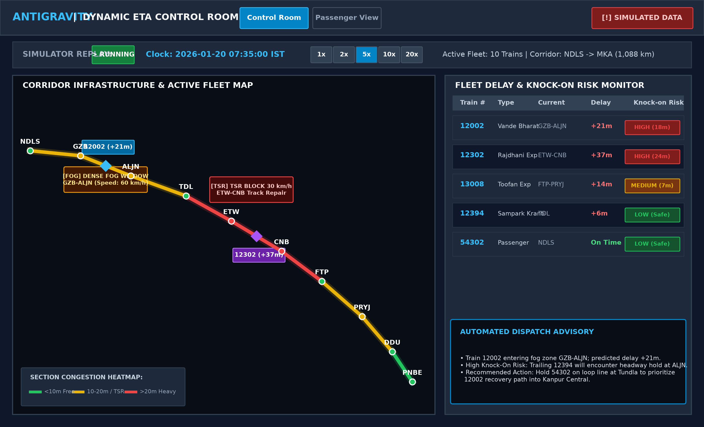
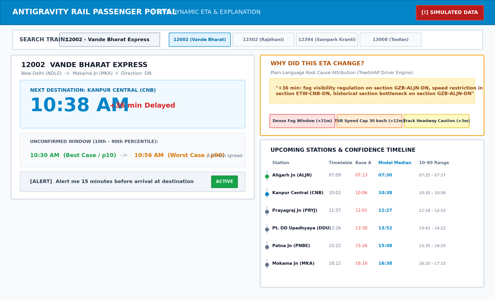

# Dynamic Forecast of Expected Time of Arrival (ETA) for Coaching Trains

**Smart India Hackathon 2026 — Problem Statement SIH26028**  
*Ministry of Railways | Software | Smart Automation*

[](https://www.python.org/)
[](https://fastapi.tiangolo.com)
[](https://react.dev/)
[](https://lightgbm.readthedocs.io/)
[](https://docs.docker.com/compose/)
[](tests/)

---

> [!WARNING]
> ### Transparency & Honesty Rule (Simulated Data Disclaimer)
> All data used, generated, or replayed across this platform is **synthetic and simulated** for research and demonstration purposes. It realistically models corridor physics, temporary speed restrictions (TSRs), peak junction congestion, seasonal Indo-Gangetic fog regulations, dwell overruns, and knock-on safety headways along a 15-station, 1,088 km trunk route (`NDLS` to `MKA`). It does **not** connect to live NTES feeds and does not claim to represent real-time Indian Railways operations.

---

## Table of Contents
1. [Project Overview & Problem Statement](#project-overview--problem-statement)
2. [Key Capabilities](#key-capabilities)
3. [System Architecture](#system-architecture)
4. [Screenshots & User Experience](#screenshots--user-experience)
5. [Evaluation & Benchmark Results](#evaluation--benchmark-results)
6. [Quickstart (Docker Compose)](#quickstart-docker-compose)
7. [Manual Setup Guide (From Fresh Clone)](#manual-setup-guide-from-fresh-clone)
8. [Running the Live Replay Demo](#running-the-live-replay-demo)
9. [Verification & Audit Scripts](#verification--audit-scripts)
10. [Repository Structure](#repository-structure)

---

## Project Overview & Problem Statement

Today, passenger ETAs at intermediate stations on Indian Railways are predominantly derived from static timetable schedules plus the currently observed delay at the last station (`ETA = ScheduledTime + CurrentDelay`), or nominal transit time calculations.

These status-quo methods fail in real operations because they ignore:
- **Temporary Speed Restrictions (TSRs)** on downstream block sections.
- **Cascading Congestion** at major junction hubs (e.g., Kanpur Central, Prayagraj Jn, Pt. DD Upadhyaya Jn).
- **Seasonal Weather Regulations** (e.g., dense winter fog visibility caps of 60 km/h).
- **Headway & Knock-On Delays** from delayed preceding trains occupying track blocks.
- **Priority Class Asymmetries** (premium trains recover delay; slower trains absorb ripple holds).

### The Solution: Antigravity Dynamic ETA Engine
This system continuously recalculates downstream arrival times using:
1. **Section-by-Section Iterative Delay Propagation**: Simulates route progression step-by-step.
2. **Quantile Uncertainty Envelopes**: Outputs 10th (best-case), 50th (median), and 90th (worst-case) percentile ETAs.
3. **TreeSHAP Explainability**: Converts complex model attributions into plain-language human reasoning (e.g. *"+36 min: fog visibility regulation on section GZB-ALJN, speed restriction in section ETW-CNB"*).
4. **Knock-On Safety Headway Estimation**: Alerts dispatchers to trailing trains facing track contention.

---

## Key Capabilities

- **Sub-Second Live Updates**: Real-time WebSocket streaming (`/ws/trains/{run_id}`) synchronized with a corridor replay engine.
- **Zero Temporal Leakage**: Enforces strict out-of-time splits; features never look ahead of the prediction moment.
- **Dual User Portals**:
  - **Control-Room View**: Live Leaflet corridor map, track section delay heatmap, fleet monitor sorted by delay, active disruption markers, and automated dispatch advisories.
  - **Passenger View**: Train search, live dynamic ETA hero card, 10–90 percentile bounds, "Why Did This Change?" explanation panel, upcoming stops timeline, and alert toggle.
- **Automatic Fallback Resilience**: Seamless transition to 3-second REST polling if the WebSocket drops, with background reconnection.

---

## System Architecture

```
                                  CORRIDOR OPERATIONAL TOPOLOGY
                     [NDLS -> GZB -> ALJN -> TDL -> ETW -> CNB -> ... -> MKA]
                                                │
                                                ▼
┌────────────────────────────────────────────────────────────────────────────────────────┐
│                                SIMULATOR & DATABASE LAYER                              │
│  • SQLite Corridors DB (data/trains.db): 15 Stations, 28 Sections, 900 Runs, 466 Disr  │
│  • Seeded Synthetic Corridors Generator (scripts/inspect_data.py)                      │
│  • Time-Accelerated Live Replay Engine (src/simulator/replay.py, 1x to 20x speed)      │
└──────────────────────────────────────┬─────────────────────────────────────────────────┘
                                       │
                                       ▼
┌────────────────────────────────────────────────────────────────────────────────────────┐
│                              FEATURE ENGINEERING PIPELINE                              │
│  • 21 Engineered Features: Line speed, distance, scheduled runtime, departure hour,    │
│    fog window flag, priority class, speed factor, upstream delay trend, disruption     │
│    severity, historical section mean/std delay (computed strictly on train split)     │
└──────────────────────────────────────┬─────────────────────────────────────────────────┘
                                       │
                                       ▼
┌────────────────────────────────────────────────────────────────────────────────────────┐
│                        PREDICTIVE MODELING & INFERENCE ENGINE                          │
│  • LightGBM Regressor (models/v1_lgbm.pkl): Single-section added delay predictor       │
│  • Quantile Regressors (models/quantile_models.pkl): Pinball loss at p10, p50, p90     │
│  • Forward Iterative Propagation Engine (src/models/propagation.py)                    │
│  • Downstream Knock-On Headway Risk Estimator (src/models/propagation.py)              │
│  • TreeSHAP Explainability & Plain-Language Driver Formatter (src/explain/)            │
└──────────────────────────────────────┬─────────────────────────────────────────────────┘
                                       │
                                       ▼
┌────────────────────────────────────────────────────────────────────────────────────────┐
│                             FASTAPI BACKEND SERVICE (PORT 8000)                        │
│  • REST Endpoints: /health, /trains, /trains/{id}/eta, /trains/{id}/explain, /replay/* │
│  • WebSocket Hub: /ws/trains/{run_id}, /ws/trains/all (src/api/ws_manager.py)          │
│  • OpenAPI Specification & Pydantic Validation Schemas                                 │
└──────────────────────────────────────┬─────────────────────────────────────────────────┘
                                       │
                    ┌──────────────────┴──────────────────┐
                    ▼                                     ▼
┌──────────────────────────────────────┐  ┌──────────────────────────────────────┐
│       CONTROL-ROOM DASHBOARD         │  │         PASSENGER WEB PORTAL         │
│  • Interactive Leaflet Heatmap Map   │  │  • Train Search & Fast Selection     │
│  • Moving Train Markers & Status     │  │  • Dynamic Median ETA Hero Card      │
│  • Section Congestion Colors (G/Y/R) │  │  • Calibrated Uncertainty (p10–p90)  │
│  • Fleet Table with Knock-On Tags    │  │  • "Why Did This Change?" SHAP Panel │
│  • Replay Controls (1x, 2x, 5x, 20x) │  │  • Upcoming Stations Timeline        │
└──────────────────────────────────────┘  └──────────────────────────────────────┘
```

---

## Screenshots & User Experience

High-resolution visual mockups of both application views are preserved in `reports/`:

### 1. Control-Room View

*Figure 1: Control-Room interface featuring the interactive corridor infrastructure map with real-time section congestion heatmapping, active fog and TSR disruption callouts, moving train markers with delay pills, fleet table sorted by delay, and automated knock-on dispatch advisories.*

### 2. Passenger View

*Figure 2: Passenger Portal interface displaying Train 12002 Vande Bharat Express live ETA (+36 min delay), the calibrated 10th–90th percentile arrival window, the plain-language TreeSHAP "Why Did This Change?" explanation panel, and the upcoming station timeline.*

---

## Evaluation & Benchmark Results

Evaluated across **16,408 test prediction points** on the out-of-time test dataset (`2026-01-02` to `2026-01-29`, 28 calendar days, 280 complete train runs):

### Forecast Horizon Benchmark Table

| Forecast Horizon | Test Samples | Baseline A MAE (min) | Baseline A RMSE (min) | Baseline B MAE (min) | Baseline B RMSE (min) | LightGBM MAE (min) | LightGBM RMSE (min) | ML vs Base A | ML vs Base B |
|---|---|---|---|---|---|---|---|---|---|
| **1 station ahead** | 2,688 | 6.17 | 10.58 | 3.77 | 7.22 | **1.97** | 3.28 | **+68.1%** | **+47.8%** |
| **2 stations ahead** | 2,408 | 11.45 | 17.26 | 8.45 | 13.48 | **5.50** | 8.14 | **+51.9%** | **+34.9%** |
| **3 stations ahead** | 2,128 | 16.34 | 22.73 | 12.50 | 18.34 | **8.75** | 12.05 | **+46.5%** | **+30.0%** |
| **4+ stations ahead** | 9,184 | 35.36 | 44.63 | 27.02 | 35.96 | **24.10** | 31.88 | **+31.9%** | **+10.8%** |
| **Overall (All Horizons)** | **16,408** | **24.60** | **35.27** | **18.60** | **28.33** | **15.75** | **24.48** | **+36.0%** | **+15.3%** |


### Train Class Breakdown

| Train Class | Priority | Test Samples | Baseline A MAE (min) | Baseline B MAE (min) | LightGBM MAE (min) | ML vs Base A | ML vs Base B |
|---|---|---|---|---|---|---|---|
| **Vande Bharat** | P1 | 1,568 | 15.54 | 15.00 | **5.54** | **+64.3%** | **+63.0%** |
| **Rajdhani** | P1 | 560 | 15.14 | 22.21 | **6.75** | **+55.4%** | **+69.6%** |
| **Superfast** | P2 | 2,520 | 13.17 | 12.52 | **6.60** | **+49.9%** | **+47.3%** |
| **Mail/Express** | P3 | 5,880 | 25.83 | 17.67 | **17.08** | **+33.9%** | **+3.4%** |
| **Passenger** | P4 | 5,880 | 31.60 | 22.76 | **21.93** | **+30.6%** | **+3.6%** |
| **Overall** | -- | **16,408** | **24.60** | **18.60** | **15.75** | **+36.0%** | **+15.3%** |

### Prediction Interval Empirical Coverage (10th–90th Percentile)
- **Overall Empirical Coverage**: **85.5%** (target: $\approx 80\%$, safe band $70\%\text{--}90\%$).
- **Calibrated Uncertainty Expansion**: Mean width widens organically from **10.1 min** at 1 station ahead to **52.7 min** at 4+ stations ahead without exploding or collapsing.


For complete mathematical descriptions and disruption case studies, see [`reports/evaluation.md`](reports/evaluation.md).

---

## Quickstart (Docker Compose)

The easiest way to run the complete stack (Backend + Frontend + SQLite DB) is with Docker Compose:

```bash
# 1. Clone repository
git clone https://github.com/your-username/sih26028-eta.git
cd sih26028-eta

# 2. Build and run containers
docker compose up --build
```

- **Frontend Application**: [http://localhost:5173](http://localhost:5173)
- **FastAPI Documentation**: [http://localhost:8000/docs](http://localhost:8000/docs)
- **Health Check**: [http://localhost:8000/health](http://localhost:8000/health)

---

## Manual Setup Guide (From Fresh Clone)

### Prerequisites
- **Python**: 3.11 or higher
- **Node.js**: 18.x or higher, and npm
- **Git**

### Step 1: Clone and Configure Environment
```bash
git clone https://github.com/your-username/sih26028-eta.git
cd sih26028-eta

# Copy environment configuration
cp .env.example .env
```

### Step 2: Backend Setup
```bash
# Create and activate virtual environment
# Windows (PowerShell):
python -m venv .venv
.\.venv\Scripts\activate

# Linux / macOS:
# python3 -m venv .venv
# source .venv/bin/activate

# Upgrade pip and install dependencies
pip install --upgrade pip
pip install -r requirements.txt

# Run full test suite (asserts all 35 tests green)
pytest -v
```

### Step 3: Frontend Setup
```bash
# Navigate to frontend directory
cd frontend

# Install npm packages
npm install

# Verify production build succeeds
npm run build
cd ..
```

### Step 4: Launch Applications
**Terminal 1 — Backend (FastAPI)**:
```bash
uvicorn src.api.main:app --host 127.0.0.1 --port 8000 --reload
```

**Terminal 2 — Frontend (Vite)**:
```bash
cd frontend
npm run dev
```

Open [http://localhost:5173](http://localhost:5173) in your browser.

---

## Running the Live Replay Demo

To experience the full dynamic ETA capabilities, follow the **5-Beat Demo Story** detailed in [`DEMO.md`](DEMO.md):

1. **Open the Web Dashboard**: Navigate to [http://localhost:5173](http://localhost:5173).
2. **Start the Replay**:
   - In the **Control Room**, click **▶ Start Replay** and set speed to **5x** or **10x**.
   - Watch trains move along the map and track sections update color based on congestion.
3. **Observe Disruption Injection**:
   - Notice the yellow/red section alerts (`[FOG]` on `GZB-ALJN` and `[TSR]` on `ETW-CNB`).
4. **Live Passenger Updates**:
   - Switch to **Passenger View** and search for `12002` (Vande Bharat Express).
   - Observe the live ETA jump to `10:38 AM (+36m)` and the plain-language explanation generate **without a browser refresh**.
5. **Inspect Knock-On Risk**:
   - In the Control Room, observe trailing train `12394` flagged with **HIGH (18m)** knock-on risk and automated loop line holding recommendations.

---

## Verification & Audit Scripts

Each subsystem has a dedicated validation script in `scripts/`:

```bash
# 1. Regenerate complete evaluation report, tables, and PNG plots
python scripts/generate_evaluation_report.py

# 2. Check API endpoints, REST schemas, and live WebSocket streaming
python scripts/check_api.py

# 3. Audit LightGBM model vs Baselines and run leakage injection test
python scripts/check_model.py

# 4. Validate prediction interval coverage and width stability
python scripts/check_intervals.py

# 5. Check TreeSHAP explanations against active disruption events
python scripts/check_explanations.py

# 6. Verify baseline heuristics across horizons
python scripts/check_baselines.py
```

---

## Repository Structure

```
sih26028-eta/
├── .env.example             # Default environment variables
├── .gitignore               # Git ignore rules
├── Dockerfile               # Production Docker container for FastAPI backend
├── docker-compose.yml       # Full stack containerization (Backend + Frontend)
├── pyproject.toml           # Project configuration & ruff/pytest settings
├── requirements.txt         # Pinned Python dependencies
├── README.md                # Main system documentation & setup guide
├── SPEC.md                  # Comprehensive engineering specification
├── DATA.md                  # Corridor topology & simulation assumptions
├── DEMO.md                  # 5-beat presentation & video demonstration script
├── data/
│   └── trains.db            # SQLite database (15 stations, 900 runs, disruptions)
├── models/
│   ├── v1_lgbm.pkl          # Trained LightGBM section delay forecaster
│   └── quantile_models.pkl  # Trained quantile regressors (p10, p50, p90)
├── reports/
│   ├── evaluation.md        # Consolidated Phase 8 benchmark evaluation report
│   ├── model_vs_baselines_mae.png   # Horizon benchmark comparison plot
│   ├── case_study_eta_timeline.png  # Ground-truth case study timeline plot
│   ├── screenshot_control_room.png  # Control-Room interface screenshot
│   └── screenshot_passenger_view.png# Passenger Portal interface screenshot
├── src/
│   ├── api/                 # FastAPI routes, Pydantic schemas, WebSocket manager
│   ├── db/                  # SQLAlchemy ORM models, session factory, migrations
│   ├── explain/             # TreeSHAP drivers, templates, ETA change logging
│   ├── features/            # Causal feature pipeline (zero leakage)
│   ├── models/              # Baselines A & B, LightGBM model, quantiles, propagation
│   └── simulator/           # Corridor topology, timetable generator, replay engine
├── scripts/                 # Automated audit, evaluation, and benchmark runners
├── tests/                   # 35 unit, integration, and anti-leakage test suites
└── frontend/                # React 18 + Vite + TypeScript web application
    ├── Dockerfile           # Production container for Vite frontend
    ├── package.json         # NPM package dependencies
    ├── vite.config.ts       # Vite configuration with backend proxy
    └── src/
        ├── api/             # REST & WebSocket client with polling fallback
        ├── components/      # ControlRoomMap, PassengerView, TrainTable, Replay
        └── types/           # TypeScript interfaces for corridor entities
```

---

## License
MIT License. Developed for Smart India Hackathon 2026.
